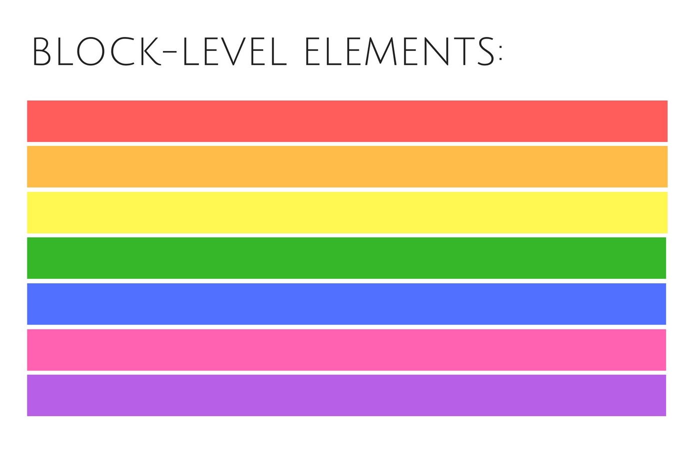

[Home](../../README.md) / [React JS](../README_HTML_CSS.md)

# Скелет HTML-документа


HTML-документ складається з «дерева» тегів. Далі наведений мінімально необхідний набір тегів, який слугує основою будь-якого HTML-документа, як фундамент для будинку.

```html
<!DOCTYPE html>
<html lang="uk">
  <head>
    <!-- Службова інформація -->
  </head>
  <body>
    <!-- Зміст -->
  </body>
</html>
```

## Оголошення типу документа

`<!DOCTYPE >` - це не тег, а обов'язкова інструкція оголошення типу документа. Вона потрібна для того, щоб повідомити браузеру, в якій версії HTML написаний документ.

На підставі доктайпу браузер визначає версію HTML і правильно відображає сторінку. Оголошення типу документа повинно бути найпершим, що бачить браузер під час обробки HTML-документа.

```html
<!-- Вказує на те, що документ написаний за специфікацією HTML Living Standard -->
<!DOCTYPE html>
```

```
ЦІКАВО
Раніше в HTML були версії, остання - це HTML5. Зараз HTML Living Standard - це єдина специфікація мови HTML, в якій відмовилися від версій, вона просто оновлюється. Якщо говорять про HTML5, то це те саме, що «сучасний HTML» або HTML Living Standard, тільки коротше.
```

## Елементи верхнього рівня

Призначені для формування основної структури веб-сторінки і визначають розділи заголовка і тіла документа.

### Тег `<html>`

Кореневий елемент документа як контейнер, який містить в собі увесь вміст сторінки. Все, що знаходиться за його межами, не сприймається браузером як HTML-код і не обробляється.

```html
<!DOCTYPE html>
<html lang="ru"></html>
```

Атрибут `lang` вказує, якою мовою написаний текст сторінки. Це необхідно для допоміжних технологій, таких як скрінрідери тощо.

### Тег `<head>`

Призначений для зберігання службової інформації про сторінку: заголовок, опис, кодування тощо. Вся ця інформація не відображається у вікні браузера, однак, містить дані, які вказують браузеру, яким чином потрібно обробляти сторінку.

```html
<!DOCTYPE html>
<html lang="uk">
  <head>
    <!-- Службова інформація -->
  </head>
</html>
```

### Тег `<body>`

Містить вміст майбутньої веб-сторінки. Контент, який повинен відображатися на сторінці, варто розташовувати саме всередині цього тегу.

```html
<!DOCTYPE html>
<html lang="uk">
  <head>
    <!-- Службова інформація -->
  </head>
  <body>
    <!-- Зміст -->
  </body>
</html>
```

## Теги заголовка документа

Група службових тегів, які розташовуються в шапці документа. Більшість з них безпосередньо не відображаються у вікні браузера.

### Заголовок сторінки

Текст, розміщений всередині тегу `<title>`, відображається у вкладці браузера. Довжина заголовка повинна бути не більше 60 символів, щоб повністю поміститися у заголовку. Текст заголовка повинен містити короткий опис вмісту веб-сторінки.

```html
<!DOCTYPE html>
<html lang="uk">
  <head>
    <title>HTML5 це просто!</title>
  </head>
  <body>
    <!-- Зміст -->
  </body>
</html>
```

### Метадані

Тег `<meta>` використовується для зберігання інформації, призначеної для браузера і пошукових систем: встановлення кодування документа, передача інформації пошуковим системам і багато іншого. Мета-тегів може бути кілька, тому що, залежно від використаних атрибутів, вони несуть різну інформацію.

Кодування сторінки необхідно вказати для того, щоб браузер коректно відобразив текст. Якщо цього не зробити, або задати невірне кодування, замість символів браузер може відобразити ієрогліфи.

```html
<!DOCTYPE html>
<html lang="uk">
  <head>
    <!-- utf-8 - найпоширеніше кодування -->
    <meta charset="utf-8" />
    <title>HTML5 це просто!</title>
  </head>
  <body>
    <!-- Зміст -->
  </body>
</html>
```

Короткий опис змісту допомагає пошуковим системам краще проіндексувати сторінку.

```html
<!DOCTYPE html>
<html lang="uk">
  <head>
    <meta charset="utf-8" />
    <meta name="description" content="Вивчення основ HTML5 для новачків" />
    <title>HTML5 - це просто!</title>
  </head>
  <body>
    <!-- Зміст -->
  </body>
</html>
```

[Мета-теги, які розуміє Google](https://support.google.com/webmasters/answer/79812)

## Потік документа

Потік - це вертикальний і горизонтальний порядок відображення елементів на сторінці. Вертикально потік йде зверху вниз, і, за замовчуванням, елементи відображаються на сторінці в тому порядку, в якому вони вказані в HTML-документі. Горизонтально потік йде зліва направо (або справа наліво для східних країн).

Всі без винятку елементи - це прямокутні області, які займають певне місце у так званих «рядках», як слова в реченні на аркуші в лінійку. Існує два основних типи елементів - блокові і рядкові.

```html
<!-- Абзац - це блоковий елемент -->
<p>Блоковий елемент 1</p>
<p>Блоковий елемент 2</p>
<p>Блоковий елемент 3</p>

<!-- Посилання - це рядковий елемент -->
<a href="">Рядковий елемент 1</a>
<a href="">Рядковий елемент 2</a>
<a href="">Рядковий елемент 3</a>
```

**Блоковий елемент (block-level element)** - займає повністю увесь рядок, незалежно від обсягу його контенту, тому кілька блокових елементів візуально йдуть один за одним зверху вниз.



**Рядковий елемент (inline element)** - займає місце по своєму вмісту, тому кілька малих елементів можуть розташовуватися на одному рядку. Якщо в рядку не вистачає місця для вміщення рядкового елемента, він переноситься на новий рядок.


```
УВАГА
З потоком документа, блоковими, рядковими, блочно-рядковими, а також флекс-елементами ми детально познайомимося на наступних уроках.
```