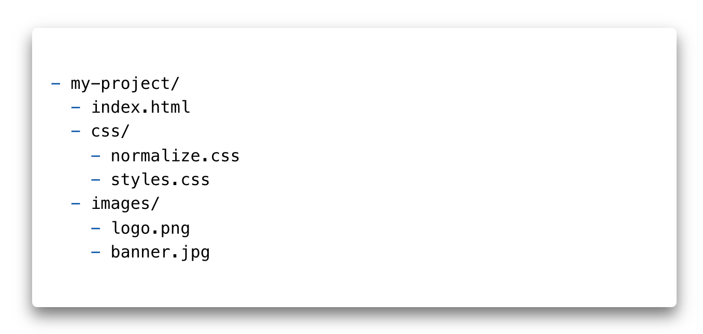

[Home](../../README.md) / [React JS](../README_HTML_CSS.md)

# Зображення

Використання графіки робить веб-сторінки візуально привабливішими. Зображення допомагають краще передати суть і зміст документа. [Тег ``](https://html.spec.whatwg.org/multipage/embedded-content.html#the-img-element) призначений для розмітки зображень у різних графічних форматах.

```html

```

* `src="шлях"` - обов'язковий атрибут, вказує адресу зображення. Шлях до зображення може бути абсолютним, або відносним.
* `alt="опис"` - обов'язковий атрибут, альтернативний опис.
* `width="значення"` і `height="значення"` - задають розміри зображення в пікселях. Без зазначення розмірів зображення відображається на сторінці в оригінальному розмірі. Якщо задати тільки одну величину, браузер автоматично вирахує іншу для збереження пропорцій.

## Атрибут `alt`

Необхідний для надання важливої інформації для користувачів, які не можуть бачити зображення (з вадами зору), або якщо зображення не завантажилось. Альтернативний текст повинен бути у кожному тезі ``.

* В описі повинна бути закінчене, повністю сформоване речення.
* Альтернативний текст повинен відповідати на питання «Що зображено на малюнку?».
* Опис повинен бути унікальним і не повторювати те, що вже присутнє в тексті до цього зображення.
* В описі не потрібно використовувати слова «зображення», «малюнок» або «ілюстрація», це само собою зрозуміло.


Якщо в тексті сторінки описується історія цих кошенят, наступного опису буде достатньо.

```html

```

У разі, якщо у нас просто галерея зображень, без будь-якого текстового опису, необхідно уточнити, що саме зображено на малюнку.

```html

```

## Зображення-посилання

Посилання не обов'язково повинне бути з текстовим контентом. Дуже часто, особливо в інтернет-магазинах, клік на зображення товару зі списку товарів, перенаправляє користувача на сторінку цього товару.

Для створення зображення-посилання обгортаємо тег `` посиланням.

```html
<a href="https://www.pexels.com/photo/animals-sweet-cat-kitty-57416/">
  
</a>
```

## Зображення з підписом

Таке завдання часто зустрічається в статтях, де багато зображень з поясненням під або над зображенням, наприклад ілюстрації, графіки або діаграми. Якщо необхідно розмітити зображення з підписом, можна використовувати теги `` та абзац `<p>`. Але, саме для таких завдань існують семантичні теги `<figure>` і `<figcaption>`.

Всередину `<figure>` поміщаємо розмітку зображення та опис. Тег `<figcaption>` обов'язково повинен бути першою або останньою дитиною `<figure>`.

```html
<figure>
  <!-- Довільний графічний контент: фотографія, графік, діаграма тощо -->
  
  <figcaption>Текст пояснення, який буде під зображенням</figcaption>
</figure>
```

## Абсолютні і відносні шляхи

Веб-сайти містять безліч файлів, які розміщують в окремі папки, щоб ними було легше керувати. Для того щоб створити зв'язок між різними файлами, наприклад в HTML-документі підключити зображення або файл стилів, використовуються абсолютні або відносні шляхи, що описують розташування файлу, який підключається.

### Абсолютний шлях

Вказує точне місце розташування файлу в структурі папок на сервері. Абсолютний шлях дозволяє отримати доступ до файлу зі сторонніх ресурсів.

```html
https://images.pexels.com/photos/583842/pexels-photo-583842.jpeg
```

Абсолютні адреси складаються мінімум з трьох частин: протокол, ім'я сервера і шлях до файлу.

* `https://` - протокол.
* `images.pexels.com` - ім'я сервера.
* `/photos/583842/pexels-photo-583842.jpeg` — шлях до файлу зображення, де «photos» і «583842» - імена папок. Папка «583842» вкладена в «photos».

```
ЦІКАВО
Наприклад, по кліку на посилання з такою адресою, в браузері відкриється вкладка із зображенням, яке лежить десь на сервері в інтернеті.
```

### Відносний шлях

Описує шлях до ресурсу щодо поточного файлу. Використовується для складання шляхів до зображень, файлів стилів або створення навігації на інші сторінки сайту, який ви створюєте.

Візьмемо стандартну структуру файлів і папок проекту.



Для того щоб в `index.html` достукатися до зображення логотипу з папки `images`, в атрибуті `src` потрібно вказати відносний шлях, тобто щодо HTML-документа.

```html
<a href="">
  
</a>
```

Символ `/` означає перехід на один рівень нижче. Такий шлях браузер буквально розуміє як: «В папці `images`, на одному рівні з поточним файлом `index.html`, взяти файл `logo.png`».

У майбутньому необхідно буде підключати зображення у файлі стилів. Для того щоб у файлі `styles.css` достукатися до зображення логотипу з папки `images`, необхідно вказати відносний шлях (щодо файлу стилів).

```css
background-image: url('../images/logo.png');
```

Послідовність символів `../` означає перехід на одну папку (рівень) вище. Такий шлях браузер буквально розуміє як: «Перейти на одну папку вище (назад), зайти в папку `images` і взяти в ній файл `logo.png`».

## Графічні формати


Векторна графіка буде відображатися однаково добре на звичайних екранах і на екранах з високою піксельною щільністю. Растрова графіка, особливо стиснута з втратою якості, буде виглядати розмито.

### Растрова графіка

**Растрова графіка (raster, bitmap)** - опис графічного файлу у вигляді масиву з координатами кожного пікселя і описом кольору цього пікселя. На кшталт мапи кольорів з фіксованим розміром.

Найпопулярніші растрові формати зображень:

* **JPEG** - великі файли, що не потребують прозорого фону або анімації. Цей формат ідеальний для барвистих фотореалістичних фотографій, оскільки вони можуть містити мільйони кольорів.
* **PNG** - на відміну від JPEG, має додатковий параметр для опису прозорості (альфа канал). Підходить для зображень, фон яких повинен бути прозорий або одноколірний. Використовується для іконок і декоративних елементів. Також використовується для зображень підвищеної точності - скріншотів, креслень, графіків тощо.
* **webP** - формат, що замінює PNG і JPEG, але ще з неповною підтримкою в браузерах. За однакової якості зображення, стиснуті файли будуть меншими, ніж PNG і JPEG, в середньому на 25%.

```
КОРИСНО
Відрізнити растрове зображення досить просто, достатньо збільшити його масштаб. У певний момент, зображення почне розмиватися і з'являться квадрати (пікселізація).
```

### Векторна графіка

**Векторна графіка (SVG, Scalable Vector Graphics)** - описується у вигляді правил або рівнянь, що визначають лінії, а також додаткові властивості, колір ліній і фон для фігур.

Векторна графіка ідеально підходить для простих масштабованих зображень, займаючи дуже мало місця. Проте, зі зростанням складності зображення, розмір файлу робить використання формату SVG невигідним. Векторна графіка замінює PNG і використовується для іконок, логотипів, графіків, абстрактної графіки і декоративних елементів.

```
УВАГА
З векторною графікою будемо детально знайомитися в окремому уроці.
```

## Оптимізація зображень

Зображення складають близько 90% загальної ваги ресурсів веб-сайту, тому їх необхідно оптимізувати в першу чергу. В майбутньому оптимізацією ресурсів проекту будуть займатися спеціальні інструменти, які зроблять це автоматично. Але вже зараз потрібно думати про оптимізацію ваги сторінки і використовувати спеціальні онлайн-сервіси для стиснення зображень.

* [Squoosh для оптимізації растрової графіки](https://squoosh.app/)
* [SVGOMG для оптимізації векторної графіки](https://jakearchibald.github.io/svgomg/)

Потрібно пам'ятати, що оптимізація JPEG-файлу призводить до втрати якості зображення. Тому, зменшуючи вагу зображення, погіршиться його зовнішній вигляд. Оптимізація JPEG зводиться до пошуку балансу між якістю і вагою зображення.

```
УВАГА
Оптимізація зображення здійснюється один раз. Зображення, експортоване з макету, оптимізується і тільки після цього додається в проект. :::
```

### Прогресивний JPEG

**Прогресивні JPEG-зображення** - це файли зображень у форматі `JPEG`, які були закодовані таким чином, що під час відображення вони завантажуються шарами. Прогресивний JPEG виглядає точно так само, як і звичайні JPEG-зображення. Різниця у тому, як вони відображаються під час завантаження.

Звичайні JPEG-файли завантажуються і відображаються смугами (порядково), зверху вниз. Для користувача це створює ефект поганої швидкості завантаження сторінки. Це особливо помітно у великих зображеннях або на мобільних пристроях з поганою швидкістю підключення до мережі.


Прогресивний JPEG завантажується таким чином, що відразу показується все зображення, але у поганій якості, і в процесі його завантаження якість поступово покращується до максимальної.


З точки зору користувача, прогресивний JPEG забезпечує приємніший досвід відвідування сторінки. Користувач відразу отримує повне уявлення про вміст сторінки.

### Створення

Для того щоб зробити прогресивне JPEG-зображення, достатньо скористатися спеціальними інструментами, зокрема онлайн. Наприклад, у разі оптимізації JPEG-зображень в Squoosh, вони за замовчуванням (автоматично) перетворюються у прогресивні.

Вага файлу прогресивного JPEG-зображення зазвичай трохи менша його базового JPEG-аналога.