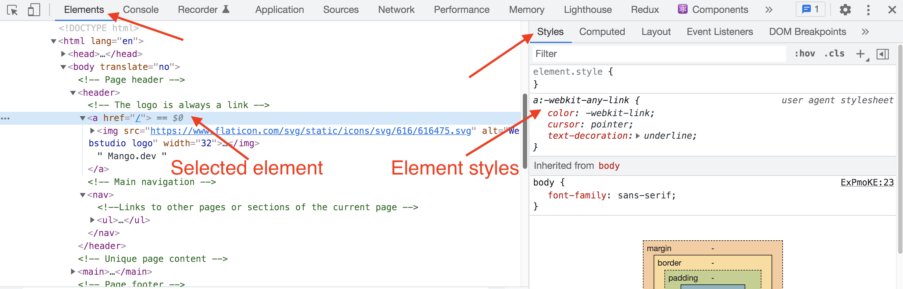

[Home](../../README.md) / [React JS](../README_HTML_CSS.md)

# Інструменти розробника

Для ефективної розробки потрібні інструменти, зокрема і для написання HTML-коду. Тому необхідно навчитися працювати з інструментами розробника. Вони присутні у всіх сучасних браузерах і не вимагають додаткового встановлення.

**Інструменти розробника** - вбудований функціонал браузера, який дозволяє отримувати інформацію про вихідний код сторінки, стилі, мережеві запити і багато іншого.

Інструменти розробника можна викликати наступними методами:

* Натиснувши клавішу `F12`
* Комбінацією клавіш `Ctrl+Shift+I` для Windows
* Комбінацією клавіш `Cmd+Opt+I` для MacOS
* На веб-сторінці натиснути правою кнопкою миші і вибрати пункт меню «Переглянути код»

До того ж, наводячи курсор миші на певний елемент, він буде підсвічуватися у вікні браузера (viewport).

Крім інспектування елементів, інструменти розробника дозволяють здійснити зміни в HTML і CSS-коді. Такі зміни відразу будуть відображені на веб-сторінці, але у вихідному коді зберігатися не будуть. Ця функція зручна для експериментів з розміткою і стилями.

[Огляд всіх можливостей DevTools](https://developer.chrome.com/devtools)