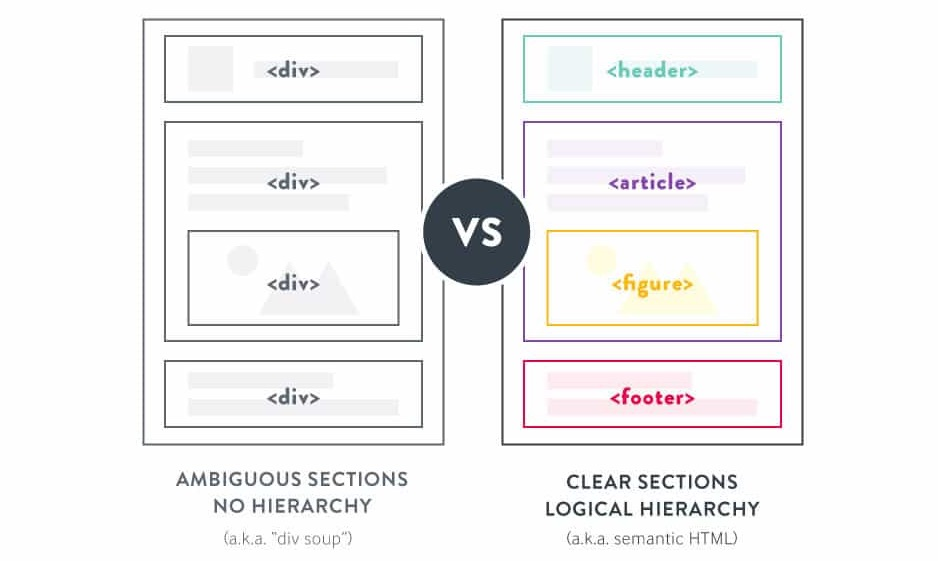

[Home](../../README.md) / [React JS](../README_HTML_CSS.md)

# Семантика

Розмітка майбутньої веб-сторінки повинна мати смислове значення, як сторінка газети або журналу. На сторінці є секції, заголовки, списки, зображення, абзаци тексту тощо. Для опису всього цього багатства типів контенту існують відповідні теги. Тобто семантика спочатку є частиною HTML, але вона марна, якщо реалізована неправильно.

**Семантична розмітка** - підхід до створення HTML-розмітки ґрунтується на використанні тегів за їх призначенням відповідно до специфікації і, які відповідають типу контенту, що розмічується.

Здебільшого семантична розмітка - це просто використання здорового глузду. Під час розмітки абзацу тексту ми використовуємо тег `
`, для розмітки посилання існує тег `<a>`, контентне зображення представлено тегом `` тощо.

Тобто семантична розмітка означає, що теги **не вибираються** на підставі того, як вони відображаються в браузері - вони вибираються на підставі типу та структури контенту, який розмічується.