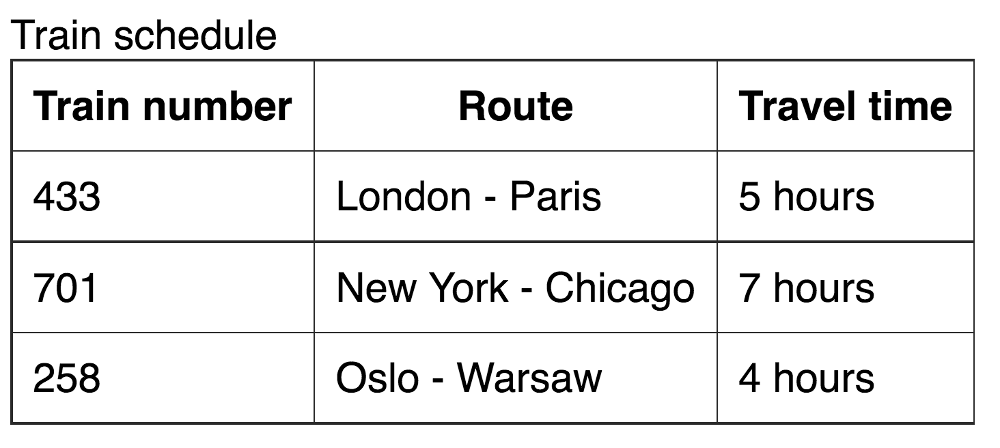
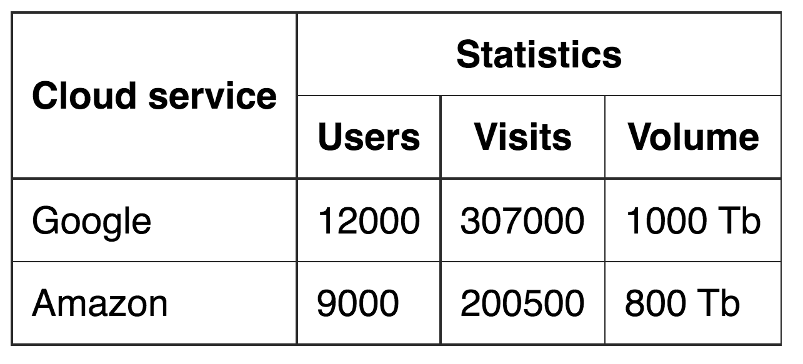

[Home](../../README.md) / [React JS](../README_HTML_CSS.md)

# Таблиці

**[Таблиці](https://html.spec.whatwg.org/multipage/tables.html#tables)** дозволяють відобразити складні зв'язки, розміщуючи в клітинках будь-який контент. Їх потрібно використовувати тільки для розмітки табличних даних: розклад транспорту, календар, результати матчів, фінансові операції, меню в ресторані, прайс-лист тощо. Тобто інформацію, яку логічно представити в табличній формі, наприклад, використовуючи Google Sheets.

```
КОРИСНО
Елементи таблиці семантично описують табличні дані, та їх використання для інших цілей - це порушення семантики.
```

Будемо набирати розмітку ось такого розкладу потягів.



Таблиця - це набір рядків з клітинками. Познайомимося з базовими тегами.

* `<table>` - визначає всю таблицю, контейнер для контенту.
* `<tr>` - рядок таблиці (table row). Не може бути порожнім, повинен містити хоча б одну клітинку.
* `<td>` - клітинка таблиці (table data). Можна використовувати тільки всередині рядка. У кожному рядку таблиці повинна бути однакова кількість клітинок.

Розмітимо розклад потягів таблицею з трьома рядками.

```html
<table>
  <tr>
    <td>433</td>
    <td>Київ - Ковель</td>
    <td>5 годин</td>
  </tr>
  <tr>
    <td>701</td>
    <td>Харків - Дніпро</td>
    <td>7 годин</td>
  </tr>
  <tr>
    <td>258</td>
    <td>Львів - Одеса</td>
    <td>4 години</td>
  </tr>
</table>
```

```
КОРИСНО
За замовчуванням у таблиці немає спеціального оформлення, наприклад, такої темної рамки як на зображенні. Для цього використовується CSS, як і для будь-якого іншого оформлення контенту.
```

## Клітинки-заголовки

Для того щоб створити рядок з заголовками стовпчиків, використовуємо стандартний тег `<tr>` для рядка, а клітинки розмічаємо спеціальним тегом `<th>` (table header) - семантичним тегом клітинки-заголовка. За замовчуванням текст всередині `<th>` виділяється жирним і центрується.

```html
<table>
  <tr>
    <th>Номер</th>
    <th>Маршрут</th>
    <th>Час у дорозі</th>
  </tr>
  <tr>
    <td>433</td>
    <td>Київ - Ковель</td>
    <td>5 годин</td>
  </tr>
  <tr>
    <td>701</td>
    <td>Харків - Дніпро</td>
    <td>7 годин</td>
  </tr>
  <tr>
    <td>258</td>
    <td>Львів - Одеса</td>
    <td>4 годин</td>
  </tr>
</table>
```

## Секції таблиці

Для підвищення семантики розмітки таблиці існує кілька структурних тегів.

* `<thead>` - шапка, обгортає групу рядків таблиці в області заголовка.
* `<tbody>` - тіло, обгортає основну групу рядків таблиці.
* `<tfoot>` - підвал, означає групу рядків таблиці в області нижнього колонтитула.

У розкладі потягів можна виділити шапку з одного рядка з назвами колонок і тіло.

```html
<table>
  <thead>
    <tr>
      <th>Номер</th>
      <th>Маршрут</th>
      <th>Час у дорозі</th>
    </tr>
  </thead>

  <tbody>
    <tr>
      <td>433</td>
      <td>Київ - Ковель</td>
      <td>5 годин</td>
    </tr>
    <tr>
      <td>701</td>
      <td>Харків - Дніпро</td>
      <td>7 годин</td>
    </tr>
    <tr>
      <td>258</td>
      <td>Львів - Одеса</td>
      <td>4 годин</td>
    </tr>
  </tbody>
</table>
```

## Заголовок таблиці

Якщо у таблиці є заголовок, звичайно можна розмітити його, використовуючи теги заголовків.

```html
<h1>Розклад потягів</h1>
<table>
  <!-- Розмітка таблиці -->
</table>

Але семантичніше буде використовувати спеціальний табличний тег <caption>, який повинен розташовуватися всередині таблиці, найпершим елементом.

<table>
  <caption>
    Розклад потягів
  </caption>

  <!-- Інша частина розмітки таблиці -->
</table>
```

Ось живий приклад результату. На вкладці `CSS` можна подивитися стилі, де до кожного з CSS-правил є коментар з поясненням.

[codepen.io](https://codepen.io/goit-academy/pen/dyXboZv)

## Групування клітинок

Деякі таблиці зроблені таким чином, що потрібно об'єднати декілька клітинок за горизонталлю або вертикаллю.



Напишемо розмітку такої таблиці, додавши додаткові клітинки, враховуючи, що «Хмарний сервіс» займе дві клітинки за вертикаллю, а «Використання» - три за горизонталлю.

```html
<table>
  <thead>
    <tr>
      <th>Хмарний сервіс</th>
      <th>Використання</th>
      <th></th>
      <th></th>
    </tr>
    <tr>
      <th></th>
      <th>Користувачі</th>
      <th>Відвідування</th>
      <th>Об`єм</th>
    </tr>
  </thead>

  <tbody>
    <tr>
      <td>Google</td>
      <td>12000</td>
      <td>307000</td>
      <td>1000 Tb</td>
    </tr>
    <tr>
      <td>Amazon</td>
      <td>9000</td>
      <td>200500</td>
      <td>800 Tb</td>
    </tr>
  </tbody>
</table>
```

Зверніть увагу на порожні теги `<th>`, в кожному рядку повинна бути однакова кількість клітинок, тому «зайві» поки що залишаємо порожніми. В результаті отримаємо наступну таблицю.

[codepen.io](https://codepen.io/goit-academy/pen/rNLBVKV)

Правило рівності кількості клітинок в рядках і стовпчиках не можна скасувати, але можна оминути. Для того щоб розширити клітинку за горизонталлю, використовується атрибут `colspan`, за вертикаллю - `rowspan`.

Потрібно визначити групу клітинок для злиття і потім крайній верхній і лівій клітинці групи задати атрибут `colspan` з кількістю клітинок, які потрібно об'єднати праворуч та/або `rowspan` - знизу. Після цього обов'язково потрібно видалити вже непотрібні клітинки праворуч та/або знизу.

У нашому завданні клітинка «Хмарний сервіс» повинна займати 2 клітинки за вертикаллю, тому додаємо їй `rowspan="2"` і видаляємо порожній `<th>` рядком нижче. Аналогічно з клітинкою «Використання», встановлюємо `colspan="3"` і видаляємо дві сусідні клітинки праворуч в цьому рядку.

```html
<table>
  <thead>
    <tr>
      <th rowspan="2">Хмарний сервіс</th>
      <th colspan="3">Використання</th>
    </tr>
    <tr>
      <th>Користувачі</th>
      <th>Відвідування</th>
      <th>Об`єм</th>
    </tr>
  </thead>

  <!-- Розмітка tbody -->
</table>
```

```
ЦІКАВО
Правило рівності кількості клітинок буде візуально порушено, але браузер враховує клітинки в об'єднаних групах, тому все правильно.
```

[codepen.io](https://codepen.io/goit-academy/pen/pobzJxM)