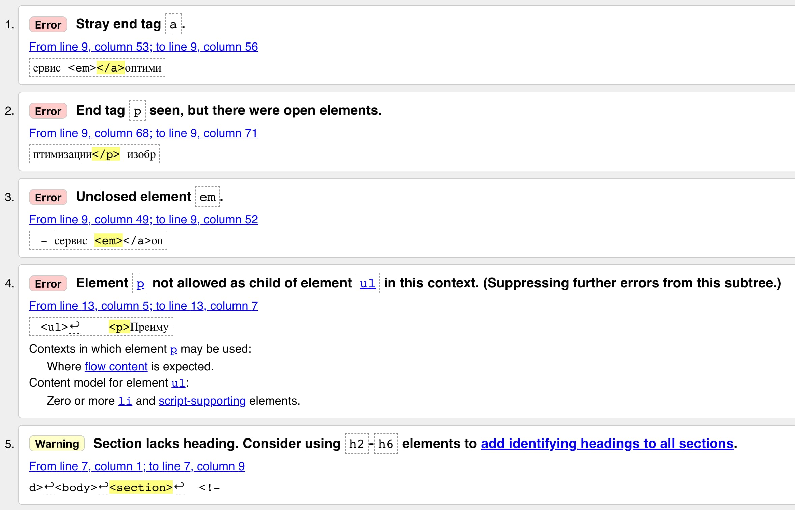

[Home](../../README.md) / [React JS](../README_HTML_CSS.md)

# Валідація

У коді важлива кожна кома, лапки і дужка, ім'я атрибута і тегу, відкриваючий і закриваючий тег. Очима, особливо новачкам, за усім цим не встежити, тому придумали валідатор.

Валідація потрібна для виявлення помилок у синтаксисі розмітки HTML-документа і розбіжностей з HTML-специфікацією, вказаною в `<!DOCTYPE >`. Програма для такої перевірки називається валідатором. В результаті валідації, документ або проходить валідацію, або отримує список рекомендованих виправлень.

```
УВАГА
Валідатори перевіряють тільки HTML-синтаксис і відповідність специфікації, а не семантику.
```

Є **[спеціальний онлайн сервіс (валідатор)](https://validator.w3.org/nu/)**, який перевіряє код HTML-документа щодо відповідності стандарту. Для перевірки необхідно всього два кроки, перший - передати валідатору вихідний код, другий - натиснути на кнопку перевірки. Передати код для валідації можна, завантаживши HTML-файл, передати посилання на живу веб-сторінку, або скопіювати і вставити увесь код.

```
КОРИСНО
Якщо передати валідатору просто окремі HTML-теги, то він видасть помилку, тому що у кожної сторінки повинен бути базовий скелет документа.
```

Валідатор перевіряє наступні пункти:

* Правильне написання тегів.
* Актуальність тегів і можливість їх застосування у поточній версії HTML.
* Правильність закриття і вкладеності тегів.
* Правильність використання атрибутів.

```html
<section>
  <!-- Не дотримується порядок закриття тегів. -->
  <p><a href="squoosh.app">Squoosh - сервіс <em></a>оптимізації</p> зображень.</em>

  <!-- Не дотримуються специфічні правила вкладення тегів. -->
  <ul>
    <p>Переваги</p>
    <li>Працює в браузері</li>
    <li>Не завантажує систему</li>
    <li>Зручний інтерфейс</li>
  </ul>
</section>
```

Якщо перевірити цей код у валідаторі (не забувши додати скелет документа), отримаємо звіт - список помилок і попереджень. У кожному елементі списку вказано значення, атрибут і елемент, які не пройшли валідацію, опис проблеми, а також наведена цитату коду з помилкою і номер рядка.



Помилки позначаються як `Error` та їх потрібно обов'язково виправляти у тому порядку, в якому вони вказані. Попередження позначаються як `Warning`, виправляти їх не обов'язково, але це причина задуматися і переглянути якість розмітки.

Виправимо всі помилки валідації в прикладі.

```html
<section>
  <p>
    <a href="squoosh.app">Squoosh</a> - сервіс <em>оптимізації</em> зображень.
  </p>

  <p>Переваги</p>
  <ul>
    <li>Працює в браузері</li>
    <li>Не завантажує систему</li>
    <li>Зручний інтерфейс</li>
  </ul>
</section>
```