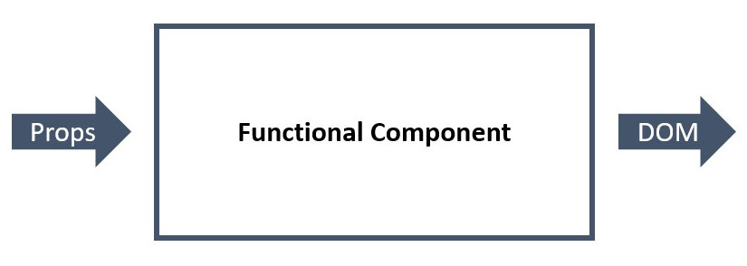

[Home](../README.md) / [React JS](./README_REACT.md)

# Компоненти

**Компоненти** – основні будівельні блоки React-застосунків, за допомогою яких інтерфейс розділяється на незалежні частини.

## Компоненти-функції

*У найпростішій формі компонент – це JavaScript-функція з дуже простим контрактом: функція отримує об'єкт властивостей, який називається `props` і повертає дерево React-елементів.*



```
ІНФОРМАЦІЯ
Ім'я компонента обов'язково повинно починатися з великої літери. Назви компонентів з маленької літери зарезервовані для HTML-елементів. Якщо ви спробуєте назвати компонент card, а не Card, під час рендеру React проігнорує його та відрендерить тег <card></card>.
```

```JavaScript
const MyFunctionalComponent = props => <div>Functional Component</div>;
```

Компоненти-функції складають більшу частину React-застосунку.

* Менше boilerplate-коду
* Легше сприймати
* Легше тестувати
* Немає контексту (this)

Зробимо картку продукту компонентом-функцією.

```JavaScript
const Product = props => (
  <div>
    
    <h2>Tacos With Lime</h2>
    <p>Price: 10.99$</p>
    <button type="button">Add to cart</button>
  </div>
);

// У розмітці компонент записується як JSX-тег
ReactDOM.createRoot(document.getElementById("root")).render(<Product />);
```

## Властивості компонента (props)

*Властивості (пропси) – це одна із основних концепцій React. Компоненти приймають довільні властивості і повертають React-елементи, що описують, що потрібно відрендерити в DOM.*

* Пропси використовуються для передачі даних від батька до дитини.
* Пропси передаються лише вниз по дереву від батьківського компонента.
* При зміні пропсів React ререндерить компонент і, можливо, оновлює DOM.
* Пропси доступні лише для читання, у дитині їх не можна змінити.


Пропсом може бути текст кнопки, зображення, url, будь-які дані для компонента. Пропси можуть бути рядками або результатом JS-виразу. Якщо передане лише ім'я пропса – це буль, за замовчуванням `true`.

```JavaScript
const App = () => (
  <>
    <h1>Best selling products</h1>
    <Product name="Tacos With Lime" />
  </>
);
```

Компонент `<Product>` оголошує параметр `props`, це завжди буде об'єкт, що містить усі передані пропси.

```JavaScript
const Product = props => (
  <div>
    <h2>{props.name}</h2>
  </div>
);
```

Додамо компоненту `<Products>` кілька інших властивостей.

```JavaScript
const Product = props => (
  <div>
    
    <h2>{props.name}</h2>
    <p>Price: {props.price}$</p>
    <button type="button">Add to cart</button>
  </div>
);
```

Відразу будемо використовувати простий патерн під час роботи з `props`. Оскільки `props` – це об'єкт, ми можемо деструктуризувати його у підписі функції. Це зробить код чистішим і читабельнішим.

```JavaScript
const Product = ({ imgUrl, name, price }) => (
  <div>
    
    <h2>{name}</h2>
    <p>Price: {price}$</p>
    <button type="button">Add to cart</button>
  </div>
);

const App = () => (
  <div>
    <h1>Best selling products</h1>
    <Product
      imgUrl="https://images.pexels.com/photos/461198/pexels-photo-461198.jpeg?dpr=2&h=480&w=640"
      name="Tacos With Lime"
      price={10.99}
    />
    <Product
      imgUrl="https://images.pexels.com/photos/70497/pexels-photo-70497.jpeg?dpr=2&h=480&w=640"
      name="Fries and Burger"
      price={14.29}
    />
  </div>
);
```

В підсумку ми створили компонент, що налаштовується, і який можна використовувати для відображення товару. Ми передаємо йому дані як пропси, а у відповідь отримуємо дерево React-елементів з підставленими значеннями.

* [Компоненти і пропси](https://reactjs.org/docs/components-and-props.html)
* [JSX в деталях](https://reactjs.org/docs/jsx-in-depth.html)
* [Spread Attributes](https://reactjs.org/docs/jsx-in-depth.html#spread-attributes)

## Значення пропсів за замовчуванням

Що якщо компонент очікує якесь значення, а його не передали? - під час звернення до властивості об'єкта `props` отримаємо `undefined`.

Для того щоб вказати значення властивостей за замовчуванням, використовується синтаксис значень за замовчуванням під час деструктуризації пропсів.

```JavaScript
const Product = ({
  imgUrl = "https://dummyimage.com/640x480/2a2a2a/ffffff&text=Product+image+placeholder",
  name,
  price,
}) => (
  <div>
    
    <h2>{name}</h2>
    <p>Price: {price}$</p>
    <button type="button">Add to cart</button>
  </div>
);

/*
 * Визначення defaultProps гарантує, що props.imgUrl матиме значення,
 * навіть якщо воно не було вказане під час виклику компонента у батька.
 */
ReactDOM.createRoot(document.getElementById("root")).render(
  <Product name="Tacos With Lime" price={10.99} />
);
```

## Властивість `props.children`

Концепція дочірніх елементів дозволяє дуже просто робити композицію компонентів. У вигляді дітей можна передавати компоненти як вбудовані, так і кастомні. Це дуже зручно під час роботи зі складними складеними компонентами.

* Властивість `children` автоматично доступна в кожному компоненті, її вмістом є те, що знаходиться між відкриваючим та закриваючим JSX-тегом.
* У функціональних компонентах звертаємось як `props.children`.
* Значенням `props.children` може бути практично все, що завгодно.

Наприклад, у нас є компонент профілю `<Profile>` та оформлювальний компонент `<Panel>`, в який ми можемо поміщати довільний контент.

```JavaScript
const Profile = ({ name, email }) => (
  <div>
    <p>Name: {name}</p>
    <p>Email: {email}</p>
  </div>
);

const Panel = ({ title, children }) => (
  <section>
    <h2>{title}</h2>
    {children}
  </section>
);

const App = () => (
  <div>
    <Panel title="User profile">
      <Profile name="Mango" email="mango@mail.com" />
    </Panel>
  </div>
);
```

В іншому разі нам би довелося прокинути пропи для `<Profile>` через `<Panel>`, що тісніше пов'язує компоненти та ускладнює повторне використання.

## Властивість `propTypes`

Перевірка типів одержуваних пропсів дозволить відловити багато помилок. Це економить час на дебаг, допомагає у разі неуважності та рятує з ростом застосунку. У майбутньому потрібно буде приділити час і познайомитися з Flow або TypeScript, а для старту вистачить невеликої бібліотеки.

Пакет [prop-types](https://www.npmjs.com/package/prop-types) надає ряд валідаторів для перевірки коректності отриманих типів даних під час виконання коду, повідомляючи про невідповідності в консолі. Все що необхідно зробити – це описати типи пропсів, що отримуються компонентом у спеціальній статичній властивості `propTypes`. Перевірка пропсів за допомогою `prop-types` відбувається лише під час розробки, у продакшені в ній немає потреби.

```bash
npm install --save-dev prop-types
```

Використаємо `prop-types` та опишемо пропси компонента `Product`.

```JavaScript
import PropTypes from "prop-types";

const Product = ({
  imgUrl = "https://dummyimage.com/640x480/2a2a2a/ffffff&text=Product+image+placeholder",
  name,
  price,
}) => (
  <div>
    
    <h2>{name}</h2>
    <p>Price: {price}$</p>
    <button type="button">Add to cart</button>
  </div>
);

Product.propTypes = {
  imgUrl: PropTypes.string,
  name: PropTypes.string.isRequired,
  price: PropTypes.number.isRequired,
};
```

Спочатку застосовуються значення за замовчуванням, задані в `defaultProps`. Після цього запускається перевірка типів за допомогою `propTypes`. Отже, перевірка типів поширюється і на значення за замовчуванням.

[Перевірка типів за допомогою PropTypes](https://reactjs.org/docs/typechecking-with-proptypes.html)