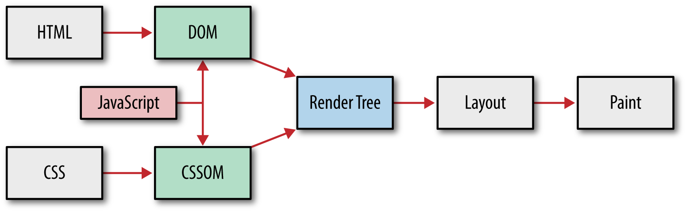
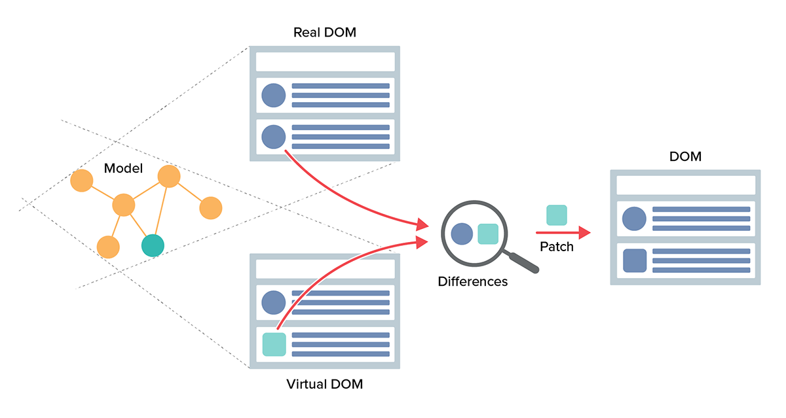
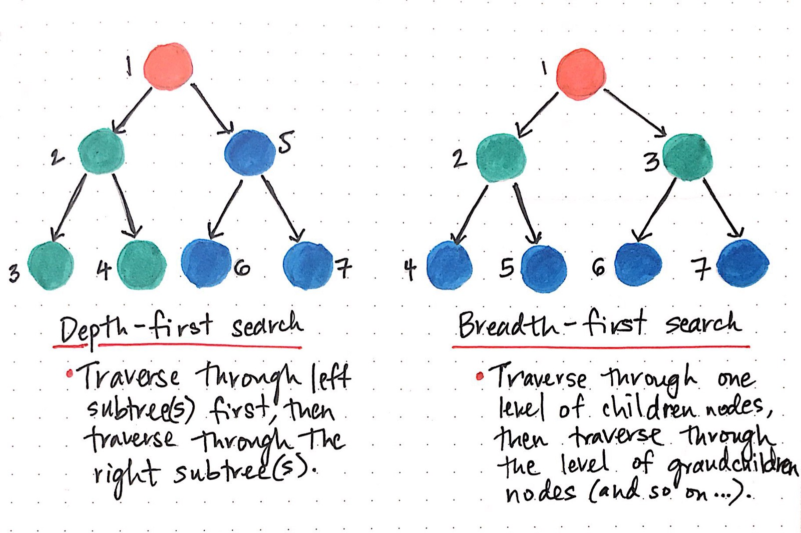
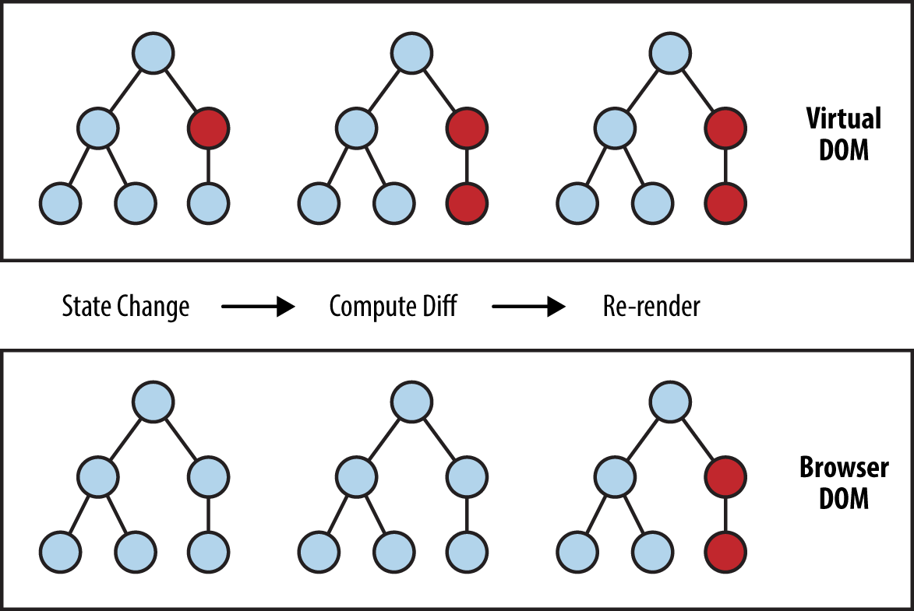

[Home](../../README.md) / [React JS](../README_REACT.md)

# Бібліотека React

React – це бібліотека для створення елементів інтерфейсу користувача. У React немає вбудованої маршрутизації, HTTP-модуля тощо. Проте є багата екосистема, яка дозволить вирішити будь-яке завдання.

При створенні застосунку з використанням React розробник не взаємодіє безпосередньо з DOM-деревом. Його завдання – описати інтерфейс за допомогою компонентів (шаблон) та керувати зміною даних (модель). React, при зміні даних моделі, сам оновить інтерфейс за шаблоном.

React – мультиплатформний, розмітку можна рендерити на сервері ([Next.js](https://nextjs.org/)), писати нативні ([React Native](https://facebook.github.io/react-native/)) або десктопні ([Electron](https://www.electronjs.org/)) застосунки.

## Browser DOM і Virtual DOM

**Browser DOM** – деревоподібне представлення HTML-документа, де кожен елемент документа представлений у вигляді DOM-вузла. Зберігається в браузері і безпосередньо пов'язаний з тим, що ми бачимо на сторінці.

З кожною зміною DOM браузер виконує кілька трудомістких операцій. Часті операції оновлення такого дерева негативно впливають на продуктивність та реакцію інтерфейсу. Тому він повільний, та оновлювати його необхідно ефективно.

**Virtual DOM** – абстракція, легковагова копія реального DOM-дерева у вигляді JSON-документа.

* Існує тільки в пам'яті і не рендериться в браузері
* Не залежить від внутрішньої імплементації браузера
* Використовує найкращі практики оновлення реального DOM
* Збирає оновлення в групи для оптимізації рендеру (batching)

## Алгоритм оновлення DOM

У React кожен елемент інтерфейсу – це компонент (кастомний або вбудований), який залежить від пропсів або стану, і представлений вузлами віртуального DOM-дерева. Взаємодія користувача з інтерфейсом змінює стан застосунку.

У разі зміни компонента створюється нове віртуальне DOM-дерево. Далі, використовуючи `breadth-first` алгоритм, відбувається порівняння (диференціювання, diffing) двох віртуальних дерев – до та після оновлення.

Червоні вузли представляють елементи, які змінилися. Обчислюється різниця між попередньою та новою версією віртуального DOM-дерева. Застосовується оптимальний варіант внесення змін до реального DOM. Це гарантує, що в реальному DOM-дереві провадиться мінімальна кількість оновлень, тим самим підвищуючи продуктивність інтерфейсу.

[Документація з Reconciliation](https://reactjs.org/docs/reconciliation.html)