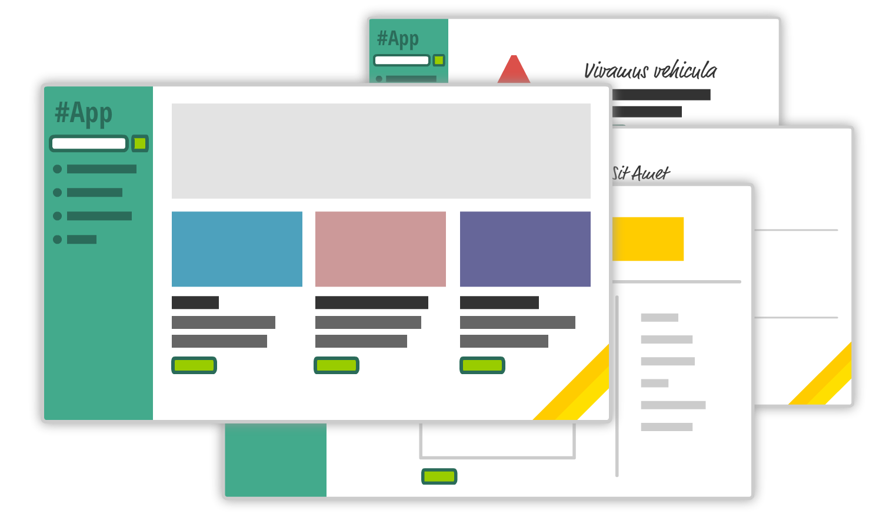
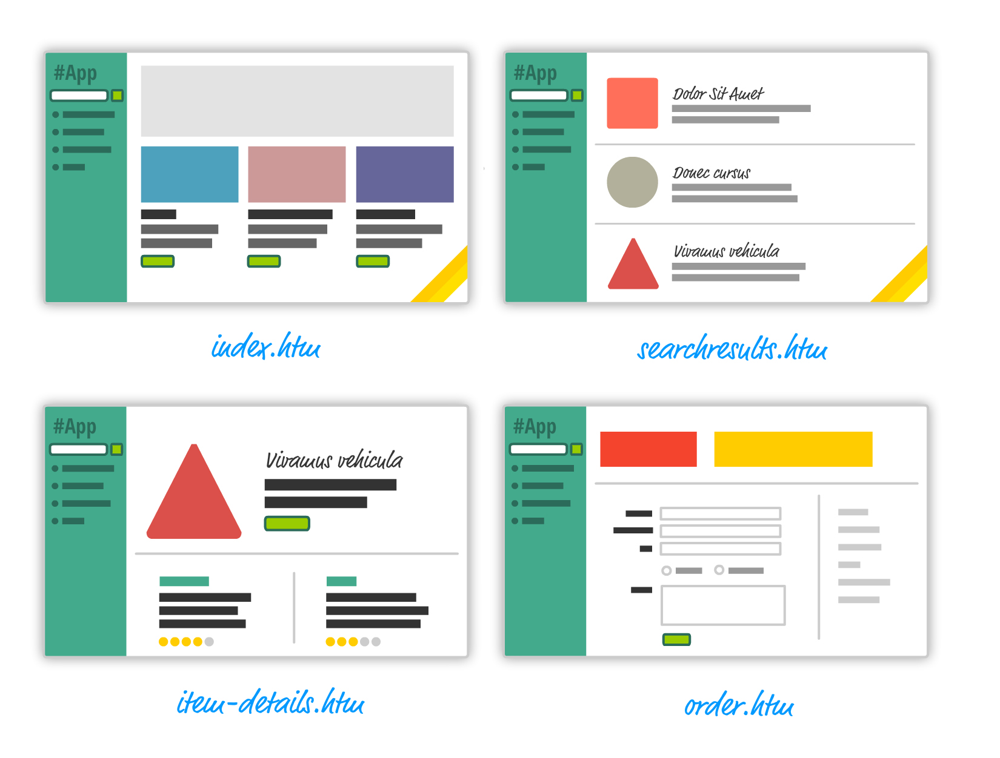
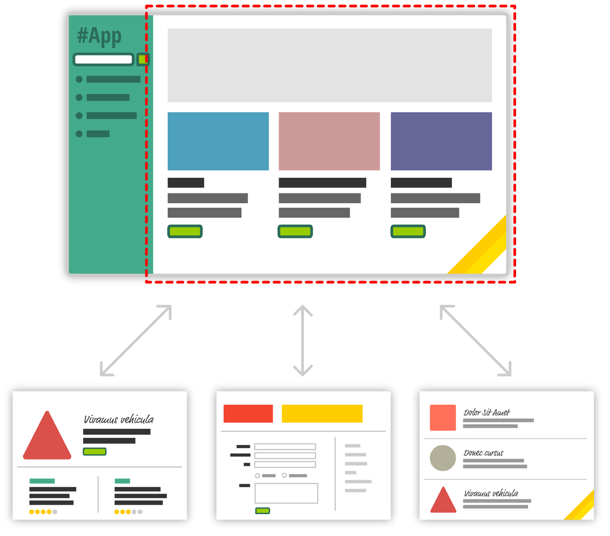

[Home](../../README.md) / [React JS](../README_REACT.md)

# Веб-застосунки

У сучасній веб-розробці змінилися не тільки техніки, що дозволяють веб-сайтам виглядати краще, завантажуватися швидше і бути приємнішими у використанні. Насамперед змінилися фундаментальні речі – те, як ми проектуємо та створюємо веб-застосунки.

Візьмемо довільний веб-сайт, наприклад, для роботи з колекцією рецептів, розкладом тренувань тощо. Завжди є набір сторінок: домашня, профіль, сторінка колекції та сторінка одного елемента колекції.

## Multiple-page Application

Кілька років тому ми використовували б підхід, який включає декілька окремих HTML-сторінок.

* Архітектура клієнт-сервер
* Вся логіка живе на сервері
* На кожен запит сервер надсилає готовий HTML-документ
* Перезавантаження сторінки при кожному запиті
* Погана інтерактивність
* Відмінне SEO

## Single-page Application

Сучасний підхід – сайт, на якому користувач ніколи не переходить на інші HTML-сторінки. Інтерфейс, замість запиту HTML-документів з сервера, перемальовується на клієнті, на одній і тій самій сторінці, без перезавантаження.

* Архітектура клієнт-сервер
* При завантаженні сайту сервер завжди віддає стартову HTML-сторінку `index.html`
* Кожен наступний запит на сервер отримує лише дані у JSON-форматі
* Оновлення інтерфейсу відбувається динамічно на клієнті
* Завантаження першої сторінки може бути досить повільним (лікується)
* Логіка, не пов'язана із безпекою, живе на клієнті
* Слабке SEO (лікується)
* Складність коду та його підтримки масштабується з кількістю функціоналу застосунку

[Single-page application vs. multiple-page application](https://medium.com/@NeotericEU/single-page-application-vs-multiple-page-application-2591588efe58)