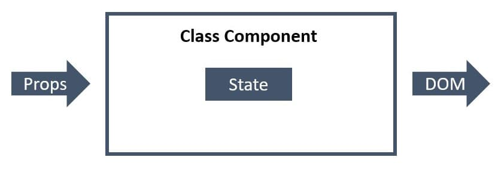

[Home](../../README.md) / [React JS](../README_REACT.md)

# Компоненти-класи

Якщо необхідно додати динаміки, компоненти створюються як класи, тому що компоненти-функції (до хуків) обмежені можливістю створення розмітки за отриманими пропсами.

* Звичайний ES6 клас, тому застосовуються правила: конструктор, методи, контекст (this).
* Обов'язково розширює базовий клас `React.Component`.
* Діє як функція, яка отримує `props`, але також реалізує приватний внутрішній стан.
* Необхідно оголосити обов'язковий метод `render()`, який викликається за замовчуванням і повертає JSX-розмітку.
Щоразу під час використання компонента-класу, React буде створювати екземпляр компонента (класу), тому доступ до пропсів відбувається через this.props.
Можна визначити кастомні методи класу і використовувати їх в будь-якому місці, зокрема всередині JSX, викликати або передавати дітям як пропси.
Коли змінюється стан або пропcи компонента, відбувається його ререндер.
// Відокремлюйте іменовані імпорти, це підвищує читабельність коду
import React, { Component } from "react";

class MyClassComponent extends Component {
  static defaultProps = {};

  static propTypes = {};

  render() {
    return 
Class Component
;
  }
}